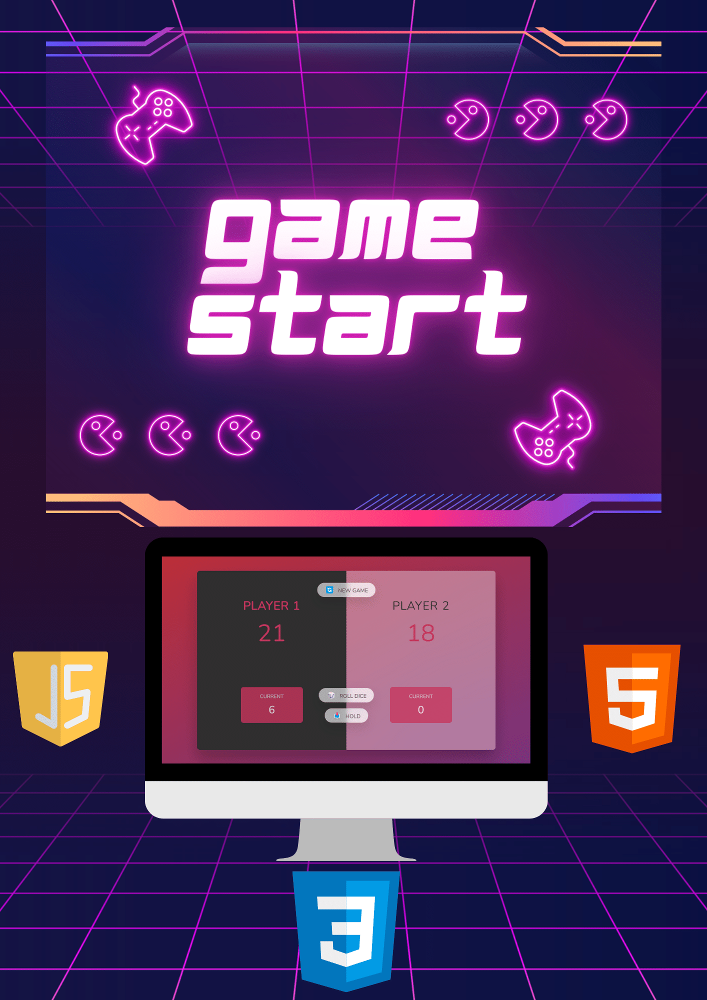

<h1>Pig Game</h1>

Pig Game is a simple dice rolling game implemented using HTML, CSS, and JavaScript. The game allows two players to take turns rolling a dice and accumulating points. The first player to reach a score of 100 wins the game.

<a href="https://pig-game-jihed.netlify.app" target="_blank">  

<h2>How to Play</h2>

<ol>
  <li>Open the <code>index.html</code> file in your web browser.</li>
  <li>The game starts with Player 1 as the active player.</li>
  <li>Click the "Roll Dice" button to roll the dice.</li>
  <li>The number shown on the dice will be added to the current player's score.</li>
  <li>If the player rolls a 1, their current score will be reset to 0, and it will be the next player's turn.</li>
  <li>Click the "Hold" button to add the current player's score to their total score.</li>
  <li>If a player's total score reaches or exceeds 100, they win the game.</li>
  <li>Click the "New Game" button to reset the game and start a new round.</li>
</ol>
<h2>Preview</h2>

<h2>File Structure</h2>

<ul>
  <li><code>index.html</code>: The main HTML file that contains the structure and layout of the game.</li>
  <li><code>style.css</code>: The CSS file that defines the visual styles and layout of the game elements.</li>
  <li><code>script.js</code>: The JavaScript file that handles the game logic and user interactions.</li>
</ul>

<h2>Dependencies</h2>

The game uses the following external dependencies:

<ul>
  <li><a href="https://fonts.googleapis.com/css2?family=Nunito&display=swap">Google Fonts</a>: This font is imported in the CSS file to style the text.</li>
</ul>

<h2>Development and Contributions</h2>

This game was developed as a learning project and contributions are welcome. If you have any suggestions, improvements, or bug fixes, feel free to create an issue or submit a pull request.

<h2>License</h2>

This project is licensed under the <a href="LICENSE">MIT License</a>. Feel free to use, modify, and distribute the code as per the terms of the license.

<h2>Acknowledgements</h2>

The Pig Game project is based on a tutorial by Jonas Schmedtmann as part of his Udemy course "The Complete JavaScript Course 2021: From Zero to Expert!"

